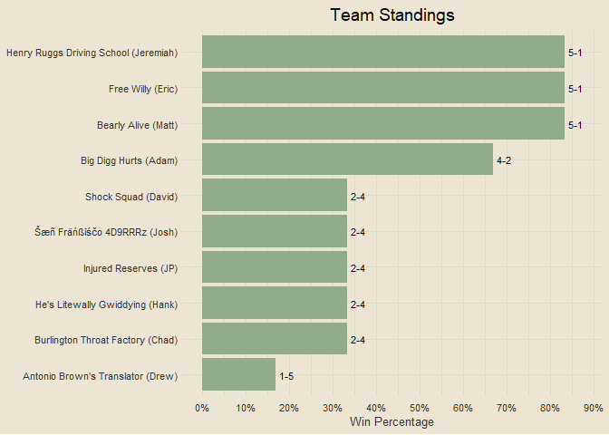
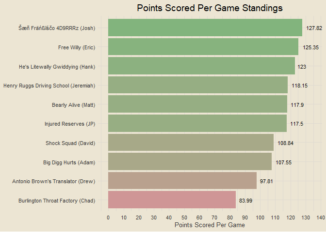
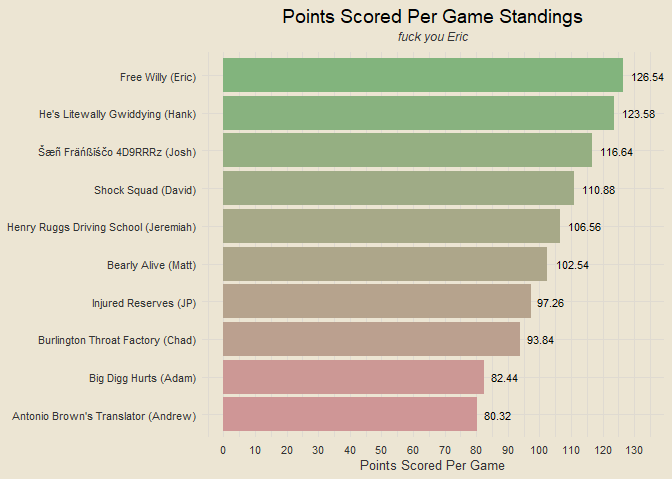
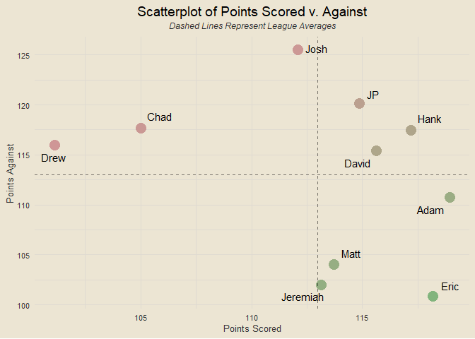
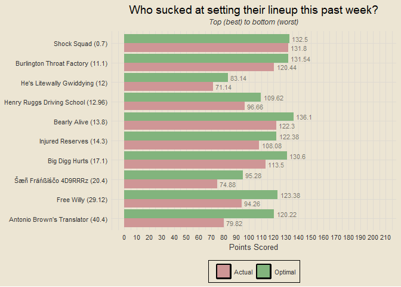
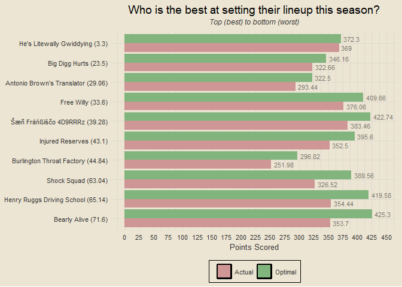
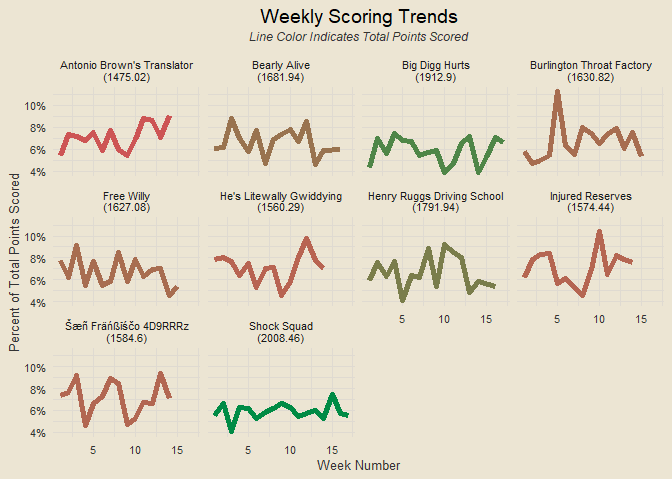
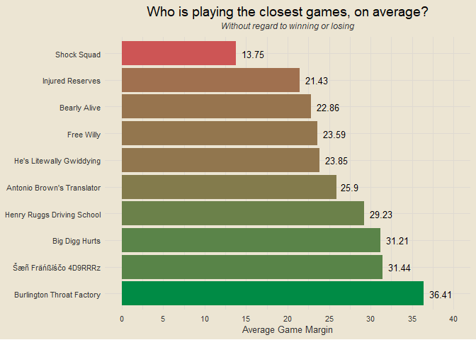
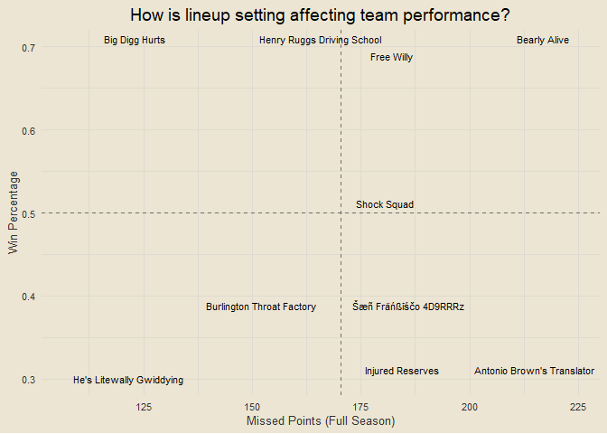

Travis Scott Burger Fantasy League
================

### Contents

- [Team Standings](#team-standings)
- [Points Scored Per Game](#points-scored-per-game)
- [Points Against Per Game](#points-against-per-game)
- [Scatterplot of Points Scored and
  Against](#scatterplot-of-points-scored-and-against)
- [Optimal Lineup Setting](#optimal-lineup-setting)
- [Season-Long Optimal Lineups](#season-long-optimal-lineups)
- [Most Points Scored in a Loss](#most-points-scored-in-a-loss)
- [Fewest Points Scored in a
  Victory](#fewest-points-scored-in-a-victory)
- [Weekly Scoring Trends](#weekly-scoring-trends)
- [Close Games](#close-games)
- [Highest Scoring Games](#highest-scoring-games)
- [Biggest Blowouts](#biggest-blowouts)
- [Closest Games](#closest-games)
- [Most Points Scored by One Team](#most-points-scored-by-one-team)
- [Fewest Points Scored by One Team](#fewest-points-scored-by-one-team)
- [Chug Analysis](#chug-analysis)

------------------------------------------------------------------------

### Team Standings

<!-- -->

------------------------------------------------------------------------

### Points Scored Per Game

<!-- -->

------------------------------------------------------------------------

### Points Against Per Game

<!-- -->

------------------------------------------------------------------------

### Scatterplot of Points Scored and Against

<!-- -->

------------------------------------------------------------------------

### Optimal Lineup Setting

<!-- -->

------------------------------------------------------------------------

### Season-Long Optimal Lineups

<!-- -->

------------------------------------------------------------------------

### Most Points Scored in a Loss

- Week 3: Free Willy def. Injured Reserves 147.9-130.44
- Week 10: Bearly Alive def. Free Willy 131.5-128.34
- Week 12: Bearly Alive def. Antonio Brown’s Translator 142.4-127.28
- Week 4: Injured Reserves def. Shock Squad 131.48-126.72
- Week 2: Shock Squad def. He’s Litewally Gwiddying 132.36-125.3

------------------------------------------------------------------------

### Fewest Points Scored in a Victory

- Week 9: Antonio Brown’s Translator def. He’s Litewally Gwiddying
  79.82-71.14
- Week 6: Free Willy def. He’s Litewally Gwiddying 88.8-82.32
- Week 4: Free Willy def. Šæñ Fräńßīśčo 4D9RRRz 89.24-72.64
- Week 9: Free Willy def. Šæñ Fräńßīśčo 4D9RRRz 94.26-74.88
- Week 15: Big Digg Hurts def. Burlington Throat Factory 98.78-85.8

------------------------------------------------------------------------

### Weekly Scoring Trends

<!-- -->

------------------------------------------------------------------------

### Close Games

<!-- -->

------------------------------------------------------------------------

### Highest Scoring Games

- Week 5: Burlington Throat Factory def. Šæñ Fräńßīśčo 4D9RRRz 184.94 to
  104.36
- Week 3: Free Willy def. Injured Reserves 147.9 to 130.44
- Week 12: He’s Litewally Gwiddying def. Big Digg Hurts 153.23 to 125.02
- Week 8: Henry Ruggs Driving School def. Bearly Alive 158.98 to 116.86
- Week 12: Bearly Alive def. Antonio Brown’s Translator 142.4 to 127.28

------------------------------------------------------------------------

### Biggest Blowouts

- Week 10: Henry Ruggs Driving School def. Šæñ Fräńßīśčo 4D9RRRz 165 to
  83.6
- Week 5: Burlington Throat Factory def. Šæñ Fräńßīśčo 4D9RRRz 184.94 to
  104.36
- Week 15: Shock Squad def. Free Willy 150.14 to 87.14
- Week 10: Injured Reserves def. Antonio Brown’s Translator 163.38 to
  102.36
- Week 14: Antonio Brown’s Translator def. Free Willy 134.86 to 75.58

------------------------------------------------------------------------

### Closest Games

- Week 13: Injured Reserves def. He’s Litewally Gwiddying 124.88 to
  122.44
- Week 10: Bearly Alive def. Free Willy 131.5 to 128.34
- Week 4: Injured Reserves def. Shock Squad 131.48 to 126.72
- Week 1: Bearly Alive def. Injured Reserves 102.54 to 97.26
- Week 1: Šæñ Fräńßīśčo 4D9RRRz def. Shock Squad 116.64 to 110.88

------------------------------------------------------------------------

### Most Points Scored by One Team

- 184.94 (Burlington Throat Factory, Week 5)
- 165 (Henry Ruggs Driving School, Week 10)
- 163.38 (Injured Reserves, Week 10)
- 158.98 (Henry Ruggs Driving School, Week 8)
- 153.23 (He’s Litewally Gwiddying, Week 12)

------------------------------------------------------------------------

### Fewest Points Scored by One Team

- 71.14 (He’s Litewally Gwiddying, Week 9)
- 72.64 (Šæñ Fräńßīśčo 4D9RRRz, Week 4)
- 72.74 (Injured Reserves, Week 8)
- 74.12 (Henry Ruggs Driving School, Week 5)
- 74.88 (Šæñ Fräńßīśčo 4D9RRRz, Week 9)

------------------------------------------------------------------------

### Chug Analysis

<!-- -->

------------------------------------------------------------------------
