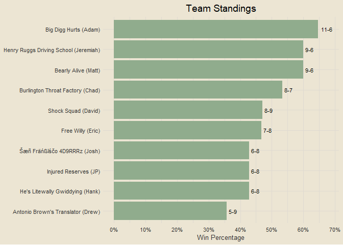

Travis Scott Burger Fantasy League
================

### Contents

- [Team Standings](#team-standings)
- [Points Scored Per Game](#points-scored-per-game)
- [Points Against Per Game](#points-against-per-game)
- [Scatterplot of Points Scored and
  Against](#scatterplot-of-points-scored-and-against)
- [Optimal Lineup Setting](#optimal-lineup-setting)

------------------------------------------------------------------------

### Team Standings

<!-- -->

------------------------------------------------------------------------

### Points Scored Per Game

<!-- -->

------------------------------------------------------------------------

### Points Against Per Game

<!-- -->

### Scatterplot of Points Scored and Against

<!-- -->

<!-- NEXT: MOST POINTS SCORED IN A LOSS / FEWEST POINTS SCORED IN A WIN -->

### Optimal Lineup Setting

<!-- -->
