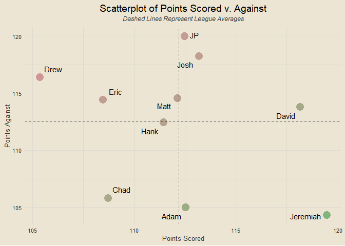
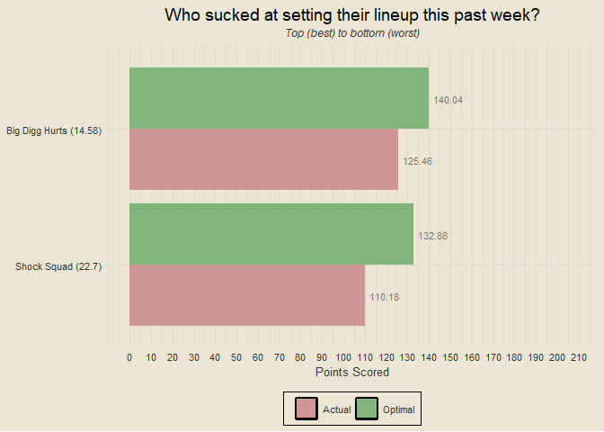

Travis Scott Burger Fantasy League
================

### Contents

- [Team Standings](#team-standings)
- [Points Scored Per Game](#points-scored-per-game)
- [Points Against Per Game](#points-against-per-game)
- [Scatterplot of Points Scored and
  Against](#scatterplot-of-points-scored-and-against)
- [Optimal Lineup Setting](#optimal-lineup-setting)
- [Season-Long Optimal Lineups](#season-long-optimal-lineups)
- [Most Points Scored in a Loss](#most-points-scored-in-a-loss)
- [Fewest Points Scored in a
  Victory](#fewest-points-scored-in-a-victory)

------------------------------------------------------------------------

### Team Standings

<!-- -->

------------------------------------------------------------------------

### Points Scored Per Game

<!-- -->

------------------------------------------------------------------------

### Points Against Per Game

<!-- -->

------------------------------------------------------------------------

### Scatterplot of Points Scored and Against

<!-- -->

------------------------------------------------------------------------

### Optimal Lineup Setting

<!-- -->

------------------------------------------------------------------------

### Season-Long Optimal Lineups

<!-- -->

------------------------------------------------------------------------

### Most Points Scored in a Loss

- Week 3: Free Willy def. Injured Reserves 147.9-130.44
- Week 2: Shock Squad def. He’s Litewally Gwiddying 132.36-125.3
- Week 2: Henry Ruggs Driving School def. Šæñ Fräńßīśčo 4D9RRRz
  135.36-120.7
- Week 3: Bearly Alive def. He’s Litewally Gwiddying 147.32-120.12
- Week 1: Šæñ Fräńßīśčo 4D9RRRz def. Shock Squad 116.64-110.88

------------------------------------------------------------------------

### Fewest Points Scored in a Victory

- Week 1: Bearly Alive def. Injured Reserves 102.54-97.26
- Week 2: Bearly Alive def. Burlington Throat Factory 103.84-77.06
- Week 3: Antonio Brown’s Translator def. Shock Squad 106.14-83.28
- Week 1: Henry Ruggs Driving School def. Big Digg Hurts 106.56-82.44
- Week 3: Henry Ruggs Driving School def. Burlington Throat Factory
  112.52-81.08
