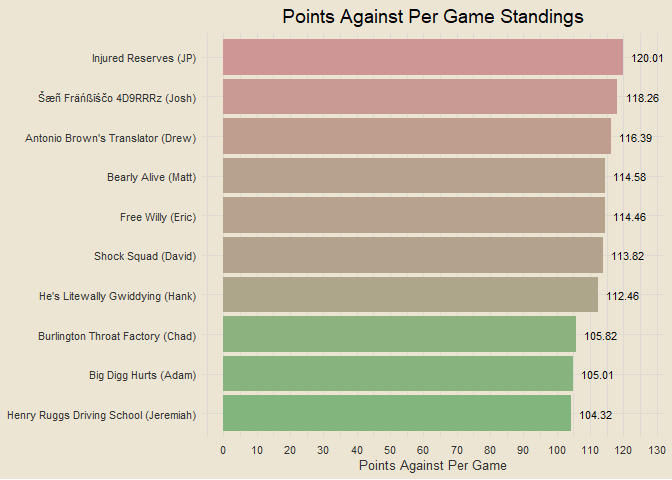
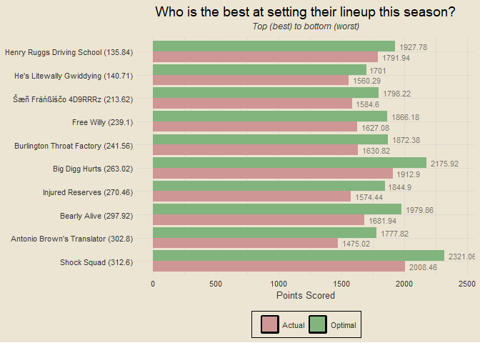
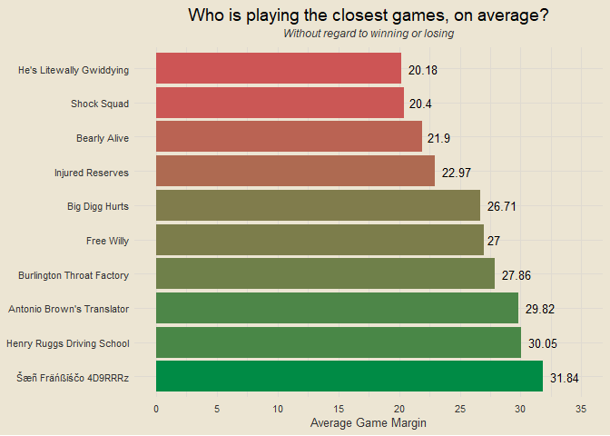

Travis Scott Burger Fantasy League
================

### Contents

- [Team Standings](#team-standings)
- [Points Scored Per Game](#points-scored-per-game)
- [Points Against Per Game](#points-against-per-game)
- [Scatterplot of Points Scored and
  Against](#scatterplot-of-points-scored-and-against)
- [Optimal Lineup Setting](#optimal-lineup-setting)
- [Season-Long Optimal Lineups](#season-long-optimal-lineups)
- [Most Points Scored in a Loss](#most-points-scored-in-a-loss)
- [Fewest Points Scored in a
  Victory](#fewest-points-scored-in-a-victory)
- [Weekly Scoring Trends](#weekly-scoring-trends)
- [Close Games](#close-games)
- [Highest Scoring Games](#highest-scoring-games)
- [Biggest Blowouts](#biggest-blowouts)
- [Closest Games](#closest-games)
- [Most Points Scored by One Team](#most-points-scored-by-one-team)
- [Fewest Points Scored by One Team](#fewest-points-scored-by-one-team)

------------------------------------------------------------------------

### Team Standings

<!-- -->

------------------------------------------------------------------------

### Points Scored Per Game

<!-- -->

------------------------------------------------------------------------

### Points Against Per Game

<!-- -->

------------------------------------------------------------------------

### Scatterplot of Points Scored and Against

<!-- -->

------------------------------------------------------------------------

### Optimal Lineup Setting

<!-- -->

------------------------------------------------------------------------

### Season-Long Optimal Lineups

<!-- -->

------------------------------------------------------------------------

### Most Points Scored in a Loss

- Week 3: Free Willy def. Injured Reserves 147.9-130.44
- Week 4: Injured Reserves def. Shock Squad 131.48-126.72
- Week 2: Shock Squad def. He’s Litewally Gwiddying 132.36-125.3
- Week 8: Free Willy def. Shock Squad 138.28-124.74
- Week 2: Henry Ruggs Driving School def. Šæñ Fräńßīśčo 4D9RRRz
  135.36-120.7

------------------------------------------------------------------------

### Fewest Points Scored in a Victory

- Week 9: Antonio Brown’s Translator def. He’s Litewally Gwiddying
  79.82-71.14
- Week 6: Free Willy def. He’s Litewally Gwiddying 88.8-82.32
- Week 4: Free Willy def. Šæñ Fräńßīśčo 4D9RRRz 89.24-72.64
- Week 9: Free Willy def. Šæñ Fräńßīśčo 4D9RRRz 94.26-74.88
- Week 1: Bearly Alive def. Injured Reserves 102.54-97.26

------------------------------------------------------------------------

### Weekly Scoring Trends

<!-- -->

------------------------------------------------------------------------

### Close Games

<!-- -->

------------------------------------------------------------------------

### Highest Scoring Games

- Week 5: Burlington Throat Factory def. Šæñ Fräńßīśčo 4D9RRRz 184.94 to
  104.36
- Week 3: Free Willy def. Injured Reserves 147.9 to 130.44
- Week 8: Henry Ruggs Driving School def. Bearly Alive 158.98 to 116.86
- Week 3: Bearly Alive def. He’s Litewally Gwiddying 147.32 to 120.12
- Week 8: Free Willy def. Shock Squad 138.28 to 124.74

------------------------------------------------------------------------

### Biggest Blowouts

- Week 5: Burlington Throat Factory def. Šæñ Fräńßīśčo 4D9RRRz 184.94 to
  104.36
- Week 7: Šæñ Fräńßīśčo 4D9RRRz def. Injured Reserves 140.74 to 83.76
- Week 4: Big Digg Hurts def. Burlington Throat Factory 141.22 to 88.2
- Week 5: Free Willy def. Henry Ruggs Driving School 125.58 to 74.12
- Week 1: He’s Litewally Gwiddying def. Antonio Brown’s Translator
  123.58 to 80.32

------------------------------------------------------------------------

### Closest Games

- Week 4: Injured Reserves def. Shock Squad 131.48 to 126.72
- Week 1: Bearly Alive def. Injured Reserves 102.54 to 97.26
- Week 1: Šæñ Fräńßīśčo 4D9RRRz def. Shock Squad 116.64 to 110.88
- Week 7: Shock Squad def. Henry Ruggs Driving School 117.18 to 111.16
- Week 6: Free Willy def. He’s Litewally Gwiddying 88.8 to 82.32

------------------------------------------------------------------------

### Most Points Scored by One Team

- 184.94 (Burlington Throat Factory, Week 5)
- 158.98 (Henry Ruggs Driving School, Week 8)
- 147.9 (Free Willy, Week 3)
- 147.32 (Bearly Alive, Week 3)
- 146.12 (Šæñ Fräńßīśčo 4D9RRRz, Week 3)

------------------------------------------------------------------------

### Fewest Points Scored by One Team

- 71.14 (He’s Litewally Gwiddying, Week 9)
- 72.64 (Šæñ Fräńßīśčo 4D9RRRz, Week 4)
- 72.74 (Injured Reserves, Week 8)
- 74.12 (Henry Ruggs Driving School, Week 5)
- 74.88 (Šæñ Fräńßīśčo 4D9RRRz, Week 9)

------------------------------------------------------------------------
