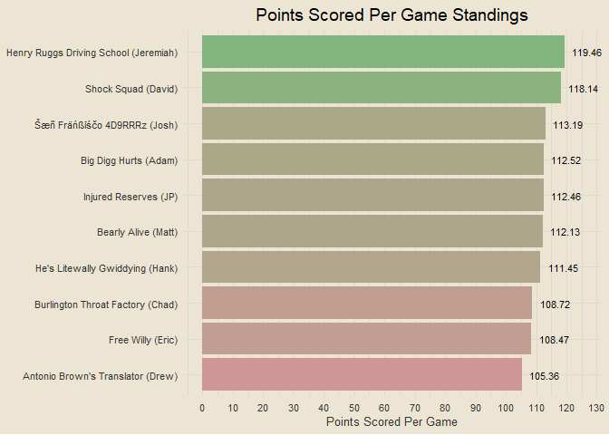

Travis Scott Burger Fantasy League
================

### Contents

- [Team Standings](#team-standings)
- [Points Scored Per Game](#points-scored-per-game)
- [Points Against Per Game](#points-against-per-game)
- [Scatterplot of Points Scored and
  Against](#scatterplot-of-points-scored-and-against)
- [Optimal Lineup Setting](#optimal-lineup-setting)
- [Season-Long Optimal Lineups](#season-long-optimal-lineups)
- [Most Points Scored in a Loss](#most-points-scored-in-a-loss)
- [Fewest Points Scored in a
  Victory](#fewest-points-scored-in-a-victory)

------------------------------------------------------------------------

### Team Standings

<!-- -->

------------------------------------------------------------------------

### Points Scored Per Game

<!-- -->

------------------------------------------------------------------------

### Points Against Per Game

<!-- -->

------------------------------------------------------------------------

### Scatterplot of Points Scored and Against

<!-- -->

------------------------------------------------------------------------

### Optimal Lineup Setting

<!-- -->

------------------------------------------------------------------------

### Season-Long Optimal Lineups

<!-- -->

------------------------------------------------------------------------

### Most Points Scored in a Loss

- Week 3: Free Willy def. Injured Reserves 147.9-130.44
- Week 4: Injured Reserves def. Shock Squad 131.48-126.72
- Week 2: Shock Squad def. He’s Litewally Gwiddying 132.36-125.3
- Week 2: Henry Ruggs Driving School def. Šæñ Fräńßīśčo 4D9RRRz
  135.36-120.7
- Week 3: Bearly Alive def. He’s Litewally Gwiddying 147.32-120.12

------------------------------------------------------------------------

### Fewest Points Scored in a Victory

- Week 4: Free Willy def. Šæñ Fräńßīśčo 4D9RRRz 89.24-72.64
- Week 1: Bearly Alive def. Injured Reserves 102.54-97.26
- Week 2: Bearly Alive def. Burlington Throat Factory 103.84-77.06
- Week 3: Antonio Brown’s Translator def. Shock Squad 106.14-83.28
- Week 1: Henry Ruggs Driving School def. Big Digg Hurts 106.56-82.44

------------------------------------------------------------------------

### IGNORE ALL THIS STUFF I’M EXPERIMENTING

``` r
opt |>
  group_by(team_name, week) |>
  reframe(pct_of_pts = round(pts / sum(pts), 3)) |>
  group_by(team_name, week) |>
  slice_max(pct_of_pts, n = 1, with_ties = F) |>
  ungroup() |>
  arrange(desc(pct_of_pts))
```

    ## # A tibble: 40 × 3
    ##    team_name                   week pct_of_pts
    ##    <chr>                      <dbl>      <dbl>
    ##  1 Šæñ Fräńßīśčo 4D9RRRz          1      0.261
    ##  2 Henry Ruggs Driving School     1      0.25 
    ##  3 Injured Reserves               3      0.227
    ##  4 Henry Ruggs Driving School     4      0.225
    ##  5 Injured Reserves               2      0.212
    ##  6 Shock Squad                    4      0.212
    ##  7 Henry Ruggs Driving School     3      0.21 
    ##  8 Big Digg Hurts                 1      0.207
    ##  9 Burlington Throat Factory      2      0.207
    ## 10 He's Litewally Gwiddying       4      0.207
    ## # ℹ 30 more rows

``` r
opt |>
  mutate(player = str_remove_all(player, "\n.*")) |>
  group_by(player) |>
  summarise(pts = sum(pts))
```

    ## # A tibble: 171 × 2
    ##    player               pts
    ##    <chr>              <dbl>
    ##  1 49ers D/ST         27   
    ##  2 A.J. Brown         67.9 
    ##  3 AJ Dillon          15.8 
    ##  4 Aaron Jones        27.6 
    ##  5 Aaron Rodgers       0   
    ##  6 Adam Thielen       11.7 
    ##  7 Aidan O'Connell     9.82
    ##  8 Alexander Mattison 40.6 
    ##  9 Allen Lazard       27.9 
    ## 10 Alvin Kamara       14.9 
    ## # ℹ 161 more rows

``` r
all_players = opt |>
  mutate(player = str_remove_all(player, "\n.*")) |>
  pull(player) |>
  unique()

regex_names = data.frame(all_players) |>
  separate(all_players, into = c("first", "last"), sep = " ") |>
  mutate(name = paste0(substr(first, 1, 1), ". ", last)) |>
  pull(name)
```

    ## Warning: Expected 2 pieces. Additional pieces discarded in 8 rows [31, 88, 92, 102, 103,
    ## 105, 109, 144].

``` r
intersect(unique(draft$player), regex_names)
```

    ##   [1] "B. Robinson"     "N. Harris"       "C. Ridley"       "D. Jones"       
    ##   [5] "M. Williams"     "D. Montgomery"   "T. Lockett"      "D. Smith"       
    ##   [9] "J. Goff"         "D. Carlson"      "K. Pickett"      "M. Stafford"    
    ##  [13] "B. Hall"         "T. Kelce"        "P. Mahomes"      "J. Burrow"      
    ##  [17] "R. Stevenson"    "B. Purdy"        "R. White"        "C. Watson"      
    ##  [21] "C. Akers"        "G. Gano"         "S. Diggs"        "J. Hurts"       
    ##  [25] "S. Barkley"      "J. Waddle"       "A. Cooper"       "M. Evans"       
    ##  [29] "G. Davis"        "B. Young"        "J. Sanders"      "J. Mixon"       
    ##  [33] "D. Prescott"     "C. Olave"        "J. Gibbs"        "A. Mattison"    
    ##  [37] "J. Myers"        "K. Allen"        "A. Richardson"   "M. Brown"       
    ##  [41] "K. Herbert"      "T. Hill"         "D. Samuel"       "T. Etienne"     
    ##  [45] "G. Smith"        "M. Sanders"      "J. Conner"       "S. Howell"      
    ##  [49] "C. Godwin"       "D. Chark"        "C. Kirk"         "J. Allen"       
    ##  [53] "C. Lamb"         "J. Herbert"      "D. Swift"        "J. Tucker"      
    ##  [57] "G. Pickens"      "D. London"       "R. Bateman"      "J. Ross"        
    ##  [61] "C. Sutton"       "M. Thomas"       "A. Gibson"       "D. Henry"       
    ##  [65] "T. Pollard"      "D. Adams"        "A. Rodgers"      "K. Cousins"     
    ##  [69] "T. Bass"         "D. Pierce"       "Q. Johnston"     "D. Cook"        
    ##  [73] "D. Waller"       "B. Cooks"        "E. Mitchell"     "T. Burks"       
    ##  [77] "J. Jefferson"    "N. Chubb"        "G. Wilson"       "T. Lawrence"    
    ##  [81] "T. Tagovailoa"   "D. Johnson"      "J. Cook"         "J. Elliott"     
    ##  [85] "E. Elliott"      "J. Chase"        "J. Taylor"       "K. Walker"      
    ##  [89] "A. Jones"        "J. Jeudy"        "D. Watson"       "R. Wilson"      
    ##  [93] "M. Andrews"      "B. Aiyuk"        "Y. Koo"          "A. Kamara"      
    ##  [97] "J. Addison"      "Z. Flowers"      "E. Moore"        "A. Ekeler"      
    ## [101] "J. Fields"       "J. Jacobs"       "H. Butker"       "T. Higgins"     
    ## [105] "D. Carr"         "G. Kittle"       "J. Smith-Njigba" "K. Pitts"       
    ## [109] "J. Dotson"       "C. Kmet"         "J. McKinnon"     "Z. Jones"
